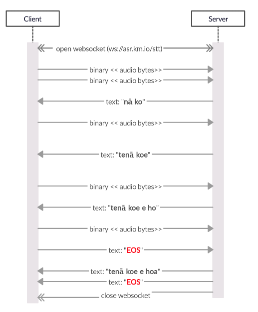

# Streaming API Demo

> Client side demo of Kōrero Māori streaming speech recognition API 

## Streaming API 

### End points

The API (incorporating this VueJS front end) is available at https://ask-keoni.com/. 

More specifically, the back end, websocket end point is at **wss://ask-keoni.com/stt**

In javascript, you would establish a socket to the end point like this:

```javascript
var socket_url = "wss://ask-keoni.com/stt";
var socket = new WebSocket(socket_url);
socket.binaryType = 'arraybuffer';
```

You can then upload 16 Bit Binary Audio data to this websocket, and receive transcribed te reo Māori text  on a streaming basis. 

### Sequence diagram 



**Notes**:
- Interim transcriptions are returned to client on a periodic basis, simultaneously to audio data being uploaded.
- Audio data should be sent as binary, PCM audio, transcriptions are returned in plain text (utf-8) format.
- Interim transcriptions can update the entire text segment (for instance, once it hears the 'e' a best guess transcription for entire fragment may change from "nā ko" to "tenā koe")
- Currently, interim transcriptions are sent every `0.8`seconds. (This may change without notice.)
- The special text string "EOS" is used to signify end of stream. 
- Once it receives the "EOS" token, the ASR server always makes one final guess for full transcription, sends a final "EOS" itself, and then closes the websocket. 

### Binary data format for audio

Audio is expected in mono, 16000 Hz, 16bit PCM format (sometimes called Wav format). 16bit PCM is a very simple, uncompressed audio format where each 2 byte integer directly corresponds the analog signal voltage sampled at that particular moment in the audio and there are 16000 samples per second. 

You may want to refer to [src/lib/streaming_recorder.js](src/lib/streaming_recorder.js#L150) for an example of how to go from a microphone to this format.

```javascript 

  _floatTo16BitPCM(input, output) {
    for (let i = 0; i < input.length; i++) {
      const s = Math.max(-1, Math.min(1, input[i]))
      output[i] = (s < 0 ? s * 0x8000 : s * 0x7FFF)
    }
  }

  _convertBuffer(arrayBuffer) {
    const data = new Float32Array(arrayBuffer)
    const out = new Int16Array(arrayBuffer.length)
    this._floatTo16BitPCM(data, out)
    return out
  }
```


### Development status : Beta

The API end point itself is currently in (early) beta. We will endeavor to keep the service available on a best efforts basis, but cannot gaurantee availability at this point. 

In return for making this early demo available we'd appreciate the following from you, potential users of this API.

- ***Please don't hold websockets open - transcribe only small audio fragments at a time***

To maximize availability please send "EOS" token and close websocket periodically - for instance whenever the speaker finishes speaking. For now, if you leave a websocket to this service open it prevents others from using this end point. So, while in beta, we'd appreciate it if you didn't leave websockets open for long periods of time, and instead re-establish the websocket oonly when audio is detected and needs to be processed.

For example, in this demo, a new websocket is established every time voice activity is detected and then an "EOS" token sent as soon as the speaker takes a breath or finishes speaking. As the back end of this service uses a GPU hosted neural network we're still working out the best to host this in a scaleable, asynchronous way. Until we have that sorted, we'd appreciate your patience with this.

- ***Please let us know if/when you intend to use it for important demos***

As mentioned above we are hosting this on a best efforts basis and will attempt to keep it available 24/7. That said, no gaurantees can be given at this stage, given that we will be iterating fast on this service. Knowing how, when and if you intend to use it is very helpful for us. You can contact us at support .... tehiku.co.nz

- ***Expect auth tokens to be added at some stage**

We are happy to take feedback on the API design. That said, modulo significant feedback, we will endeavor not to change this overall very (simple) API design. That said, we are likely to add authentication token requirements to this API at some ponit in the near future. Let us know what kind of authentication scheme you would find easiest to use (oAuth, JWT etc).

- **Retry when websocket is peremptorily closed**

If someone else already has an active websocket, the server may respond to your web socket request by simply acceptnig and then immediately closing your websocket. We will be adding more informative error messages at some later stage. For now, please retry. 


## VUE JS client Side demo

In this folder you will find example client side VueJS code designed to connect to this API.

### Python based demo

If you go here (TBC) you will see an exmaple of a command line, python based library for connecting to the same API. 

### VueJS Build Setup

``` bash
# install dependencies
yarn install

# serve with hot reload at localhost:8080
npm run dev

# build for production with minification
npm run build

# build for production and view the bundle analyzer report
npm run build --report
```

For a detailed explanation on how things work, check out the [guide](http://vuejs-templates.github.io/webpack/) and [docs for vue-loader](http://vuejs.github.io/vue-loader).


## Ngā Mihi
This demo uses code from https://github.com/kdavis-mozilla/vad.js and https://github.com/grishkovelli/vue-audio-recorder. I couldn't import them directly as I needed to modify the code a bit to suit this demo.
